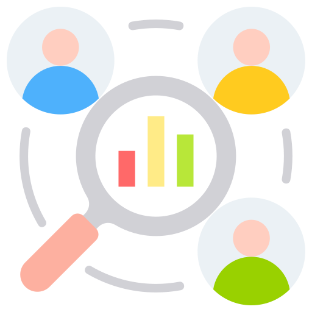

::::{grid} 1 1 2 2

:::{grid-item}
:columns: 12 12 4 4

```{image} profile.png
:alt: Hongyu Zhang
:width: 95%
```

:::

:::{grid-item}
:columns: 12 12 8 8

[Department of Earth, Geographic, and Climate Sciences](https://www.umass.edu/earth-geography-climate/), University of Massachusetts Amherst

[100 Carlson Ave](https://maps.app.goo.gl/F7fa4btW8NEovz576), Newton, MA 02459

[honzhang@umass.edu](mailto:honzhang@umass.edu) 

**Research Interests:** Data Ethics, GIScience, GeoAI

[CV (PDF)](cv.pdf) |
[Google Scholar](https://scholar.google.ca/citations?user=sWBgI7UAAAAJ&hl=en) |
[ORCID](https://orcid.org/my-orcid?orcid=0000-0002-5137-6177) |
[GitHub](https://github.com/hzhangic) |
[LinkedIn](https://www.linkedin.com/in/hongyu-zhang/) |
[Twitter](https://x.com/hzhangus) 
:::
::::

---

## Featured Projects

::::{grid} 2 2 4 4

:::{card}
:link: https://www.sciencedirect.com/science/article/pii/S2666378326000152

+++
**Geoprivacy Attitudes**
:::

:::{card}
:link: https://scholarworks.umass.edu/bitstreams/8e57ca8e-7ab5-43a2-a763-48d07527eb59/download

+++
**Geoprivacy Behaviors**
:::

:::{card}
:link: https://journals.sagepub.com/doi/pdf/10.3233/FAIA260479

+++
**GenAI in Education**
:::

:::{card}
:link: https://hzhangic.github.io/regional-similarity/

+++
**Regional Similarity**
:::

::::

---

<!-- ## Highlights

::::{grid} 2 2 3 4

:::{card} Publications 📚
:link: pages/research
10+ Refereed Publications
:::

:::{card} Software 💻
:link: pages/software
5+ Open-Source Projects
:::

:::{card} Teaching 🎓
:link: pages/teaching
5+ Courses Taught
:::

:::{card} Talks 🎤
:link: pages/talks
10+ Invited Talks
:::

:::{card} Awards 🏆
:link: pages/awards
5+ Awards & Honors
:::

:::{card} Community 🌍
:link: pages/services
Professional & institutional service
:::

:::{card} Blog ✍️
:link: pages/blog
Thoughts on research, software, and teaching
:::

:::{card} News 📰
:link: pages/news
Latest updates and milestones
:::

::::

--- -->

## Recent News

- **2026-07-13** - Joined the Early Career Editorial Board of [*Digital Geography and Society*](https://www.sciencedirect.com/journal/digital-geography-and-society)
- **2026-06-30** - Joined the Research Committee of the [University Consortium for Geographic Information Science (UCGIS)](https://www.ucgis.org/)
- **2026-06-15** - Presented at the [Workshop on GeoAI for Autonomous Spatial Analysis](https://geoai4asa.netlify.app/)
- **2026-06-04** - Received the [Open Education Initiative (OEI) Grant](https://guides.library.umass.edu/OER/open-education-initiative) from University Libraries 
- **2026-04-27** - Elected as an At-Large Board Member of the [Digital Geographies Specialty Group](https://www.aag.org/groups/digital-geographies/), American Association of Geographers (AAG)

[See all news →](pages/news)
